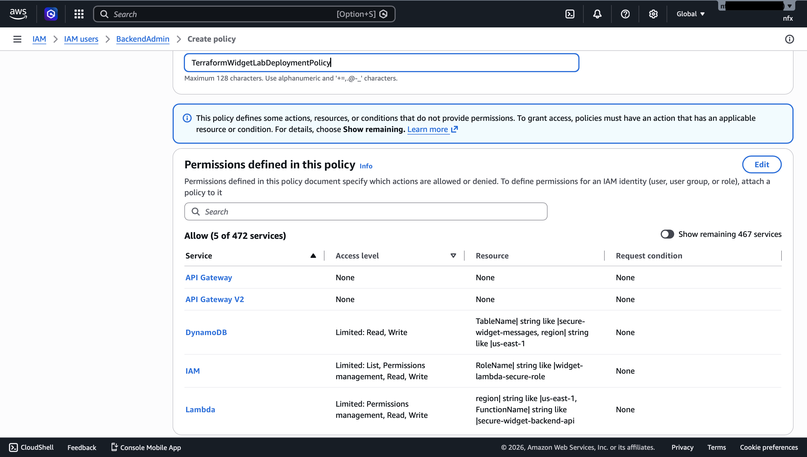
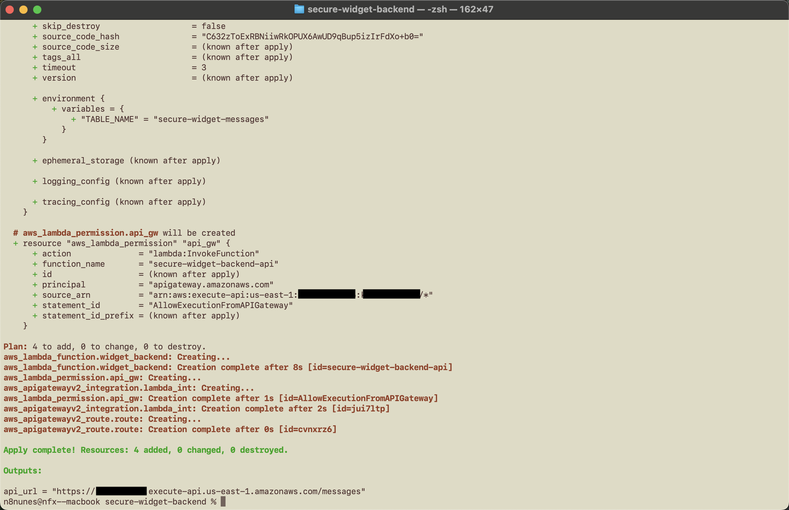
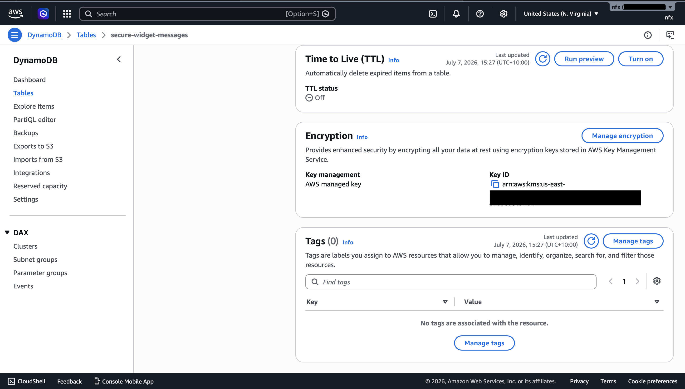

# Secure Full-Stack Serverless Messaging Framework (IaC & GRC)

## 📌 Project Overview
This repository contains the infrastructure and desktop client source code for a secure, serverless messaging application. The objective of this project was to move away from manual management and architect a cloud backend completely via Infrastructure as Code (IaC) using Terraform. 

The architecture implements strict access control boundaries, data encryption standards, and threat surface minimization, making it highly applicable to corporate data sovereignty and privacy use cases.

### Key Features
* **Infrastructure as Code (IaC):** 100% automated deployment using Terraform.
* **Zero-Trust Identity & Access Management:** Execution roles strictly bound to the principle of least privilege.
* **Encrypted Messages:** Automated Server-Side Encryption (SSE) enforced at the storage tier.
* **Desktop Client Interface:** Lightweight Python GUI executing full-duplex HTTPS API operations.

---

## 🛠️ Architecture Blueprint

[Python PC Client via Windows] ---> [Amazon API Gateway (HTTPS)] ---> [AWS Lambda] ---> [Amazon DynamoDB]

---

## 🔒 Security Posture & GRC Framework Alignment

To mirror enterprise governance expectations, technical controls within this architecture are directly mapped to standard industry compliance frameworks (such as **NIST SP 800-53** and **CIS AWS Foundations Benchmarks**).

| AWS Resource | Implemented Security Control | Framework Alignment | Architectural Justification |
| :--- | :--- | :--- | :--- |
| **Amazon DynamoDB** | AWS-KMS Managed Server-Side Encryption (SSE) | **NIST SP 800-53 (SC-28)**  Protection of Data at Rest | Guarantees complete physical volume encryption within the AWS data centre layer. Prevents downstream exposure in the event of hardware extraction. |
| **AWS IAM** | Granular Resource-Level ARN Restrictions | **NIST SP 800-53 (AC-6)**  Principle of Least Privilege | The Lambda execution role explicitly explicitly restricts database read/write permissions to a single table ARN instead of utilizing wildcard (`*`) access. |
| **AWS IAM (PassRole)** | Explicit Execution Boundaries for Administrators | **CIS Benchmark 1.16**  Maintain Safe IAM Delegations | Even administrative automation accounts are restricted from unchecked role assignment. Prevents malicious privilege escalation vectors across serverless endpoints. |
| **Amazon API Gateway** | Hardened CORS Policies & HTTPS-only Enforcement | **NIST SP 800-53 (SC-8)**  Transmission Confidentiality | Restricts unauthorized cross-origin requests (`localhost` tracking) and completely mitigates cleartext sniffing vectors by forcing TLS encryption. |

---

## 📸 Deployment & Compliance Verification Checkpoints (With Roadblocks)

### 1. Infrastructure Execution Plan Validation
Prior to resource compilation, `terraform plan` was executed to perform a predictive audit of configuration states, preventing configuration drift or unexpected resource spin-ups.

### 2. Terraform Apply Error
When trying to apply the terraform plan, I ran into an error stating that the IAM group that I had created (BackendAdmin) did not have the required permissions. I weighed up my options - give it AdministratorAccess or create a custom inline permission. I went with the latter to adhere to Least Privileges.

### 3. Least-Privilege IAM
Confirmation of the BackendAdmin permissions, showing that only the required permissions have been granted. Another screenshot showing the success screen of `terraform apply`

### 4. Data-at-rest protection
Verification from the AWS Console confirming the production DynamoDB storage tier is running active data at rest encryption.

